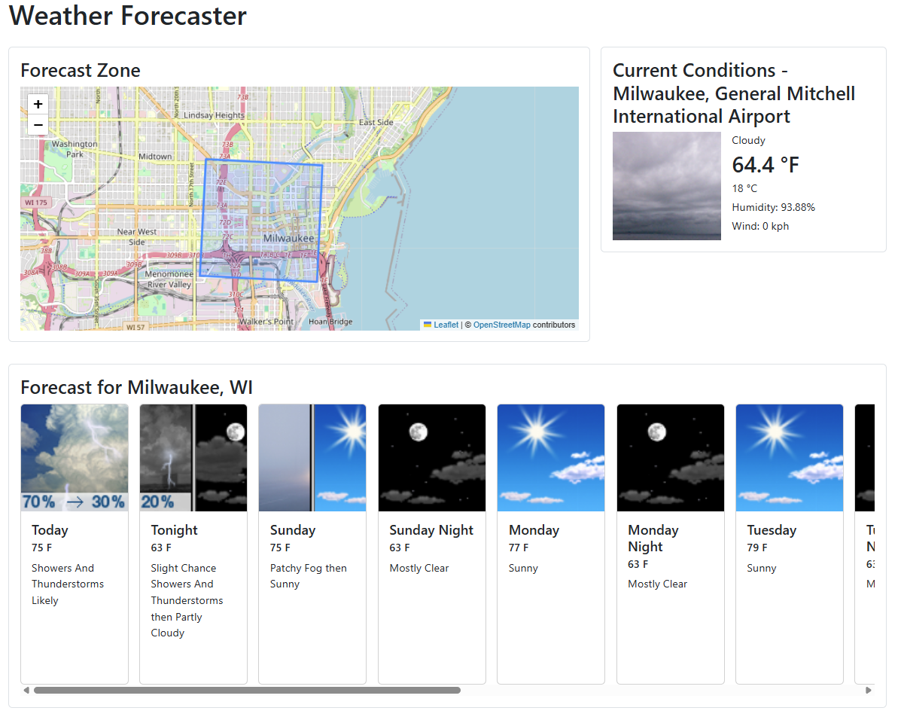
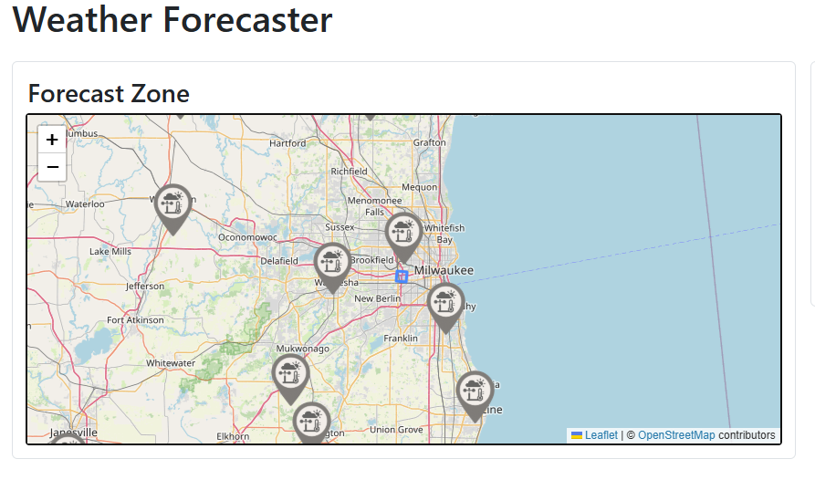
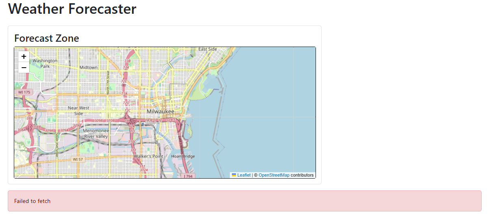
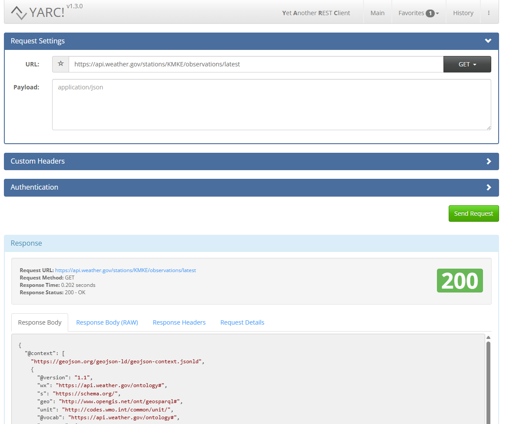

[](https://classroom.github.com/a/omWHGxZ-)
## Introduction

In this assignment, you will write a web application that uses asynchronous JavaScript requests to dynamically update a web application with JavaScript Object Notation (JSON) data retrieved from a server.  You will also be using a 3rd party library to display retrieved data on a map.

Work on the assignment is to be done ***individually***.  You are welcome to collaborate with class members, but the project must be your own work.

## Background and References

### National Weather Service

The National Weather Service (NWS) (https://www.weather.gov/) owns weather stations across the country and creates forecasts weather in those areas (https://www.weather.gov/about/).  Using the NWS website you can see current conditions, forecasts, and warnings/alerts for any region in the United States.

In addition, the NWS website hosts a web application programming interface (API) that can be used to retrieve information about weather in areas across the country.

### Leaflet

Leaflet ([https://leafletjs.com/](https://leafletjs.com/)) is a free JavaScript library for displaying and interacting with maps.  It lets you display a map at a particular location, add pinpoints, zoom in and out, etc.  However, as a user of the library you are required to provide your own map image.  For that, we will use OpenStreetMap ([https://www.openstreetmap.org/](https://www.openstreetmap.org/)) which is free open source map data.

### Resources

The following are some helpful resources:

- NWS Weather API Documentation: https://www.weather.gov/documentation/services-web-api
- Leaflet API Documentation: [https://leafletjs.com/reference.html](https://leafletjs.com/reference.html)
- JavaScript Fetch API: [https://developer.mozilla.org/en-US/docs/Web/API/Fetch_API/Using_Fetch](https://developer.mozilla.org/en-US/docs/Web/API/Fetch_API/Using_Fetch)

## Project Description

For this assignment, you will write a web application that shows the current conditions and forecast near a location on a Leaflet map.  The location will be the center of the current "view" and will be retrieved through NWS Weather API.

### The NWS Weather Application Requirements

For this assignment, you will create a web application that displays the current conditions and forecast for information retrieved from the NWS Weather API.  The application must consist of a map and some cards to display the current conditions and forecast.

The behavior of your weather application should be as follows:

- When the application loads, the user moves the center of the map view, or the user zooms in or out on the map, the application will request the current conditions and forecast, via the NWS Weather API, for the region centered at the map center.
- When the NWS Weather API returns, the results should be shown on the web application
   - The region for the current conditions and forecast must be shown on the map
     - The old region ***must*** be ***removed*** from the map, only the region for the returned results should be displayed on the map.
   - The current conditions must be displayed to the user including:
     - Current conditions image
     - Location name
     - Current conditions summary
     - Temperature in Fahrenheit
     - Temperature in Celsius
     - Humidity
     - Wind speed
   - The forecast must be displayed to the user.  Each day in the forecast must include:
     - Forecast image
     - Name of the forecast
     - Forecast temperature (with unit)
     - Forecast description
   - The location of current known "weather stations" in the region should be noted on the map with pinpoints.  The pinpoint icons must be customized in some way.
     - When the user moves the map all the weather stations for the corresponding coordinates at the map center must be marked.  Old markers ***must*** be ***removed*** from the map.

When everything is working, your weather applications should look something like this:



***NOTE:*** To see all the weather station pinpoints it might be necessary to zoom out on the map:



### Styling

The application must be styled using styles other than your browser default.  For this, consider using a styling library (e.g. Bootstrap or another of your choosing).  The choice of styling is up to you.

### Error Handling

If an error is returned from the NWS Weather API:

- The map should be cleared of region markings
- The map should be cleared of all pinpoints
- The current conditions and forecast should be cleared
- The error message should be displayed to the user

For example:



***NOTE:*** Error messages should ***NOT*** be displayed using ```window.alert```.  Consider using a Bootstrap alert: [https://getbootstrap.com/docs/5.3/components/alerts/](https://getbootstrap.com/docs/5.3/components/alerts/)

The user will have to change the zoom level or move the map center to a new location to start another query of the NWS Weather API.

## Getting Started

The following files have been provided for you in your repository:

- [WeatherForecaster.html](src/WeatherForecaster.html) - Web page HTML file (includes the imports for Bootstrap, Leaflet, and the WeatherForecaster CSS and JavaScript files)
- [WeatherForecaster.css](src/WeatherForecaster.css) - Initial styling to set up the sizes for the map
- [WeatherForecaster.js](src/WeatherForecaster.js) - JavaScript source file containing your event handlers and manipulation of the DOM

At the top of ***EACH SOURCE FILE*** include a comment block with your name, assignment name, and section number.

An initial staring location (the latitude and longitude of the MSOE athletic field) is provided for you in the [WeatherForecaster.js](src/WeatherForecaster.js).  Feel free to use this or another location as your map starting point.

The provided HTML is a starting point.  Feel free to modify the structure and styling as you like.  Just make sure your application meets the required functionality.

## Hints and Tips

### Getting the center of the map

The latitude and longitude values to use to query the NWS Weather API must come from the center of the map's current view.  The ```getCenter()``` function on the Leaflet map ([https://leafletjs.com/reference.html#map-getcenter](https://leafletjs.com/reference.html#map-getcenter)) can be used to retrieve the center of the current map view.  This function returns a JavaScript object.  See the documentation for how to retrieve the latitude and longitude values from the object.

### Handling the NWS Weather API data

In order to get all the data you need, you'll have to perform multiple queries to different NWS Weather API endpoints.

- Using the /points endpoint will all you to retrieve information about the latitude and longitude point.  However, this does not return forecast or current conditions, but it does give you additional endpoints that you can call to get the information you need.

For example, retrieving https://api.weather.gov/points/42.9449,-87.8843 results in [point_results.json](points_results.json)

If we look closer at that file we see several things:

- The ```properties.forecast``` contains the URL to fetch the forecast for the point
- The ```properties.observationStations``` contains the URL for the weather station that reports the current conditions

#### Retrieving the Current Conditions

The current conditions for a point by latitude and longitude are based on the observations of the weather station closest to that point.

1. Retrieve the point information for the latitude and longitude: ```https://api.weather.gov/points/{lat},{long}```
2. From the JSON results find the ````properties.observationStations````
3. Retrieve the JSON from the ```properties.observationStations``` URL
4. This returns a list of observation stations in the region of the point.  The first ```feature``` in the results shows the closest observation station.
5. Retrieve the JSON for the latest observation at the first station using the ```observations/latest``` endpoint
6. This returns a list of properties for the current conditions at that observation station

Use this data to generate your current conditions display:

| Current Conditions Value | JSON Field Name        |
|--------------------------|------------------------|
| Image                    | icon                   |
| Location Name            | stationName            |
| Summary                  | textDescription        |
| Temperature in Celsius   | temperature.value      |
| Humidity                 | relativeHumidity.value |
| Wind speed               | windSpeed.value        |

For example: 

1. Fetch GET: https://api.weather.gov/points/43.0442,-87.9064 - ```properties.observationStations``` is https://api.weather.gov/gridpoints/MKX/88,65/stations
2. Fetch GET: https://api.weather.gov/gridpoints/MKX/88,65/stations - ```properties.feature[0].id``` is https://api.weather.gov/stations/KMKE
3. Fetch GET: https://api.weather.gov/stations/KMKE/observations/latest returns the properties for the current conditions

#### Retrieving the Daily Forecast

To retrieve the forecast for a point with a given latitude and longitude:

1. Retrieve the point information for the latitude and longitude: ```https://api.weather.gov/points/{lat},{long}```
2. From the JSON results find the ```properties.forecast```
3. Retrieve the JSON from the ```properties.forcast``` URL
4. The forecast results contains ```properties.periods``` which is array of days for the forecast

For each period, use this data to generate your forecast display:

| Forecast Value       | JSON Field Name |
|----------------------|-----------------|
| Image                | icon            |
| Name of the Forecast | name            |
| Temperature          | temperature     |
| Temperature Unit     | temperatureUnit |
| Description          | shortForecast   |

For example:

1. Fetch GET: https://api.weather.gov/points/43.0442,-87.9064 - ```properties.forecast``` is https://api.weather.gov/gridpoints/MKX/88,65/forecast
2. Fetch GET: https://api.weather.gov/gridpoints/MKX/88,65/forecast returns the array of periods for the forecast

#### Displaying the Region on the Map

To add a region to a leaflet map, it is easiest to first add a leaflet layer group (https://leafletjs.com/reference.html#layergroup):

```javascript
const regionLayer = L.layerGroup().addTo(map);
```

This layer group can then be used to add the forecast region to the map.

The NWS Weather API for a forecast returns the region for the forecast in a format called GeoJSON (https://geojson.org/).  This data can be used without modification to add a layer to a leaflet map to show a region.

For example, assuming you have results from the forecast endpoint (see above) stored in a variable called ```data```, the region can be displayed on the map using the following leaflet API call:

```javascript
L.geoJSON(data).addTo(regionLayer);
```

***NOTE:*** Make sure you remove the old region layer from the map first or else you'll get multiple regions drawn.  This can be done by clearing the layer group:

```javascript
regionLayer.clearLayers();
```

### Using the Fetch API

You will need to use the ```fetch``` JavaScript API to make your requests for the NWS Weather API data.  Remember that this API uses promises to perform the asynchronous request.  You are welcome to use the .```then/.catch``` interface or the ```async/await``` to manage the data.  Recall that the response from a fetch represents the HTTP response as a whole.  To get the JSON data from the body you will need to invoke the JSON API.  This is also asynchronous and returns a promise.

Furthermore, recall that the fetch API only throws an error when there is a connection problem with the server.  If it receives a response from the server, even if it is an error, then fetch will not reject the promise.  You will have to manually check the response status to detect an error.

For example if you have a function called ```updateCurrentConditions``` that updates the current conditions based on JSON data from the latest observations and a function called ```handleError``` for handling errors, then using the ```.then/.catch``` you might write something like:

```javascript
fetch(URL)
   .then((response) => {
       if(response.status !== 200) {
           handleError(new Error(String(response.status)));
       }
       return response.json();
   })
   .then((responseJSON) => updateCurrentConditions(responseJSON))
   .catch((error) => handleError(error));
```

Using ```async/await```, it might look like:

```javascript
try {
    const response = await fetch(URL);
    if(response.status !== 200) {
        handleError(new Error(String(response.status)));
        return;
    } else {
        const responseJSON = await response.json();
        updateCurrentConditions(responseJSON);
    }
} catch(error) {
    handleError(error);
}
```

However, these are just examples.  Feel free to implement your fetch request as works best for you.

## Testing and Debugging

### JSON Formatting

White space in JSON data does not mean anything to the JavaScript JSON parser.  However, as humans, it can be nice to see JSON formatted in a readable way.  There are several websites and plugins that are available to do just that:

- JSON Formatter - https://jsonformatter.org/ - A website for JSON formatting
- JSON Formatter (Chrome Extension) - https://chromewebstore.google.com/detail/json-formatter/bcjindcccaagfpapjjmafapmmgkkhgoa?hl=en
- JSON Formatter (Firefox Extension) - https://addons.mozilla.org/en-US/firefox/addon/json_formatter/

### Testing Requests to the NWS Weather API

It will be helpful to test that different endpoints for the NWS Weather API are working correctly.  For this you can make requests by directly typing into the location bar of your browser.  Another tool that can be helpful is to send a custom request through REST client.  There are several available for different browsers:
  
- Yet Another Rest Client (YARC) - [https://yet-another-rest-client.com/](https://yet-another-rest-client.com/) - Extension available for Chrome
- REST client by APIsHub - [https://apishub.com/](https://apishub.com/) - Extension available for Chrome and Firefox - [https://restclient.apishub.com/](https://restclient.apishub.com/)

Here is an example of using YARC to retrieve the latest observations from the Milwaukee Airport observation station.



## Deliverables

When you are ready to submit your assignment prepare your repository:

- Make sure your name, assignment name, and section number are in comments on ALL submitted files.
- Make sure you cite your sources.
- Make sure your assignment code is commented thoroughly.
- Include in your submission, a set of suggestions for improvement and/or what you enjoyed about this assignment.
- Make sure all files are committed and pushed to the main branch of your repository.

***NOTE***: Do not forget to 'add', 'commit', and 'push' all new files and changes to your repository before submitting.

To submit, copy the URL for your repository and submit the link to Canvas.

### Additional Submission Notes

If/when using resources from material outside what was presented in class (e.g., Google search, Stack Overflow, etc.) document the resource used in your submission.  Include exact URLs for web pages where appropriate.

***NOTE:*** Sources that are not original research and/or unreliable sources are not to be used.  For example:

- Wikipedia is not a reliable source, nor does it present original research: [https://en.wikipedia.org/wiki/Wikipedia:Wikipedia_is_not_a_reliable_source](https://en.wikipedia.org/wiki/Wikipedia:Wikipedia_is_not_a_reliable_source)
- Large language models are not reliable sources: [https://stackoverflow.blog/2025/06/30/reliability-for-unreliable-llms/](https://stackoverflow.blog/2025/06/30/reliability-for-unreliable-llms/)

For more information, please see the [MSOE CS Code of Conduct](https://msoe.s3.amazonaws.com/files/resources/swecsc-computing-code-of-conduct.pdf).

## Grading Criteria

- (5 Points) Submitted files and code structure
  - Submitted files follow submission guidelines
  - Files are contain name, assignment, section
  - Sources outside of course material are cited
  - Readable code/file structure
  - Code is well documented
  - Code passes the HTML validator without errors
  - Code passes the CSS validator without errors
  - HTML contains only structure - no logic code or styling
- (5 Points) Suggestions
  - List of suggestions for improvement and/or what you enjoyed about this assignment
- (55 Points) Functionality - Correct implementation of required functionality
  - (15 Points) Forecast region is displayed on the map for location at the map center
    - When the page loads
    - When the user moves the map center (click and drag)
    - When the user changes the zoom level (in or out)
    - Old region is removed from the map
  - (15 Points) Current conditions are displayed on the page
    - All required data fields are displayed in the correct format
  - (15 Points) Forecast for the coming days (periods) are displayed on the page
    - All required data fields for all periods are displayed in the correct format
  - (10 Points) Pinpoints for weather stations correctly displayed
    - Old pinpoints are removed
    - Pinpoints use a custom icon
- (15 Points) Error Checking
  - Errors are correctly handled and displayed to the user
  - Error message is displayed not using window.alert
  - Map is cleared of regions and poinpoints when an error occurs
  - Current conditions and forecast is cleared of all data when an error occurs
  - Error message is removed when there is no longer an error
- (20 Points) Styling
  - The application is styled using custom styling and/or a styling library